<div align="center">
  
  <h1>Flutter for Wordpress</h1>
  <strong>A flutter app for a wordpress websites with clean and elegant design. This app is available in free and pro version. You can choose to use the one you need.</strong>
</div>
<br>

[](https://codemagic.io/apps/5dda7273011bc91bb5e1e928/5dda7273011bc91bb5e1e927/latest_build)


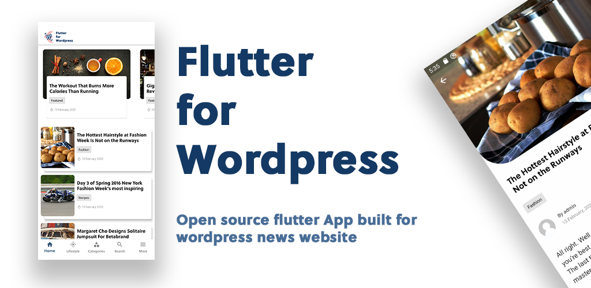

## 📌 Get Flutter for Wordpress

Flutter for wordpress is currently available in free and pro version:

|Flutter for Wordpress|Flutter for Wordpress Pro|
|---|---|
|<p align="center"></p>|<p align="center"></p>|
|<ul><li>Beautiful design</li><li>Optimized wordpress API</li><li>Latest Posts, Featured Posts, and Categories post in the app</li><li>Supports video in the post thumbnail</li><li>Supports embedded video inside the post</li><li>Post Comments and Share</li><li>Infinite Scroll</li><li>Related posts</li><li>Posts search feature</li><li>Setting page</li><li>Firebase Notification</li></ul>|<ul><li>Beautiful design</li><li>Optimized wordpress API</li><li>Latest Posts, Featured Posts, and Categories post in the app</li><li>Supports video in the post thumbnail</li><li>Supports embedded video inside the post</li><li>Post Comments and Share</li><li>Infinite Scroll</li><li>Related posts</li><li>Posts search feature</li><li>Setting page</li><li>One Signal Notification (Notification when post is updated in wordpress dashboard)</li><li>Dark theme</li><li>Admob integrated</li><li>Dynamic deep link integrated</li><li>Caching mechanism</li><li>Documentation</li></ul>|
|<p align="center">[](https://play.google.com/store/apps/details?id=com.wordpress.flutter.app)</p>|<p align="center">[](https://play.google.com/store/apps/details?id=com.wordpress.flutter.pro)</p>|
|<p align="center">Free and Open Source<p>|<p align="center"><b>39</b>$ on codecanyon<p>|
|<p align="center">[](https://github.com/l3lackcurtains/Flutter-for-Wordpress-App/releases)<p>|<p align="center">[](https://codecanyon.net/item/flutter-for-wordpress-pro/27977169)</p>|


# 🚀 Installation

You need to have a wordpress website before you implement the app.

If you have a wordpress website already then follow the simple steps given below to build your own **Wordpress Flutter App**.

### 🔥 Install a wordpress plugin

Install [Flutter for wordpress (wp plugin)](https://github.com/l3lackcurtains/flutter-for-wordpress-wp-plugin/releases) in your wordpress website before you build a mobile application. This plugin is important for the enhancement of the performance in the app. Always keep this plugin active for the mobile app to run smoothly.

If you do not want to install the plugin then you can edit the functions.php file in child theme.


### 📌 Edit your wordpress theme (Skip if plugin installed)

Update the wordpress **functions.php** file on your theme by appending the following code at the end. The app will not function correctly if this step is not followed.

```php
function flutter_news_rest_prepare_post($data, $post, $request) {
    $_data = $data->data;
    $_data["custom"]["td_video"] = get_post_meta($post->ID, 'td_post_video', true) ?? '';
    $_data['custom']["featured_image"] = get_the_post_thumbnail_url($post->ID, "original") ?? '';
    $_data['custom']["author"]["name"]   = get_author_name($_data['author']);
    $_data['custom']["author"]["avatar"] = get_avatar_url($_data['author']);
    $_data['custom']["categories"] = get_the_category($_data["id"]);
    $data->data = $_data;
    return $data;
}

add_filter('rest_prepare_post', 'flutter_news_rest_prepare_post', 10, 3);

// Enable comment without being loggedin
function filter_rest_allow_anonymous_comments() {
    return true;
}

add_filter('rest_allow_anonymous_comments','filter_rest_allow_anonymous_comments');

```

### 🔨 Edit the constants

Change the constants from the **./lib/common/constants.dart** file. For the categories name and ID refer to your wordpress website.

```dart
// Your wordpress website URL
const String WORDPRESS_URL = "https://flutterblog.crumet.com"; 

// Featured category ID (for Home Screen top section)
const int FEATURED_ID = 2;

// Tab 2 page category name
const String PAGE2_CATEGORY_NAME = "Lifestyle";

// Tab 2 page category ID
const int PAGE2_CATEGORY_ID = 6;

// Custom categories in search tab
// Array in format
// ["Category Name", "Image Link", "Category ID"]
const List<dynamic> CUSTOM_CATEGORIES = [
  ["Lifestyle", "assets/boxed/lifestyle.png", 6],
  ["Fashion", "assets/boxed/fashion.png", 12],
  ["Music", "assets/boxed/music.png", 14],
  ["Photography", "assets/boxed/photography.png", 15],
  ["Sport", "assets/boxed/sport.png", 13],
  ["World", "assets/boxed/world.png", 11],
  ["Health", "assets/boxed/health.png", 8],
  ["Travel", "assets/boxed/travel.png", 7],
  ["Recipies", "assets/boxed/recipies.png", 10],
];
```

### 🔔 Push Notification (Optional)
gh
This project uses firebase messaging for push notification.

To integrate push notification from firebase follow the steps:
- Go to firebase console
- Generate and Download **google-services.json** file
- Place **google-services.json** file inside android/app
- It should be ready now. Test your push notification.

For further instruction read documentation from https://pub.dev/packages/firebase_messaging

## 📱 Screenshots

|   |   |   |
|---|---|---|
|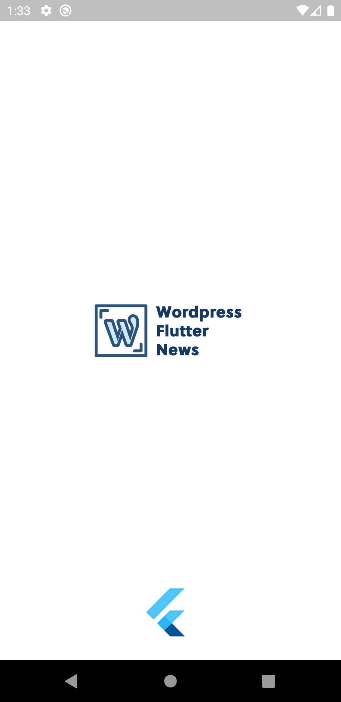|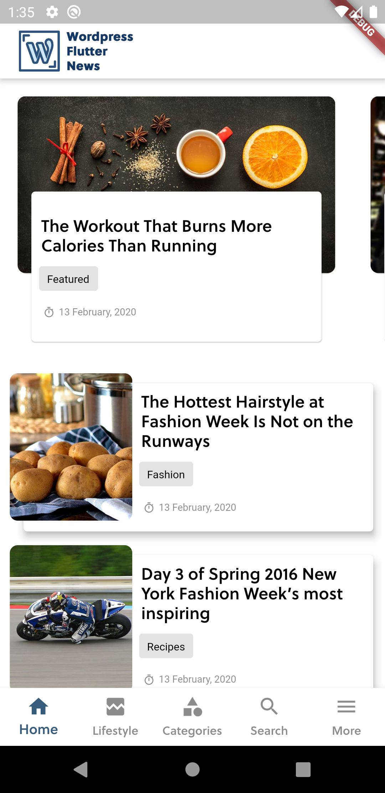|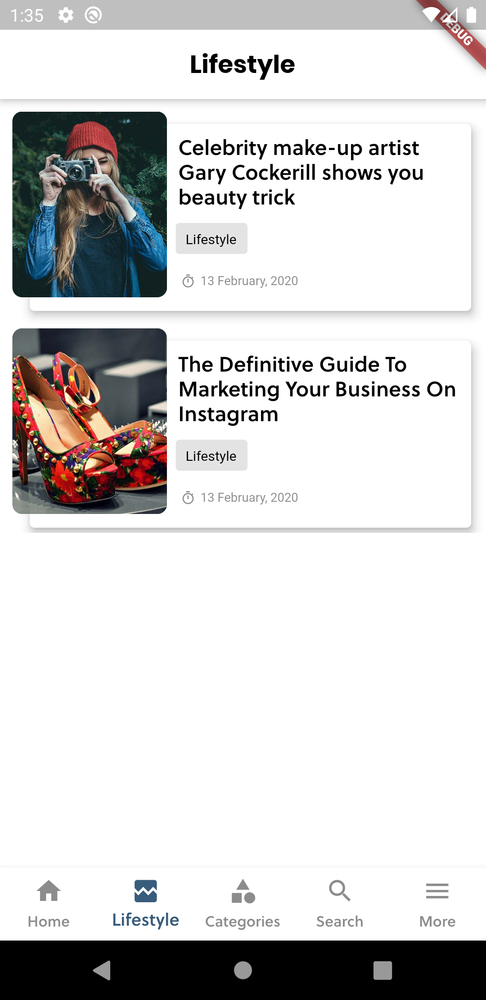|
||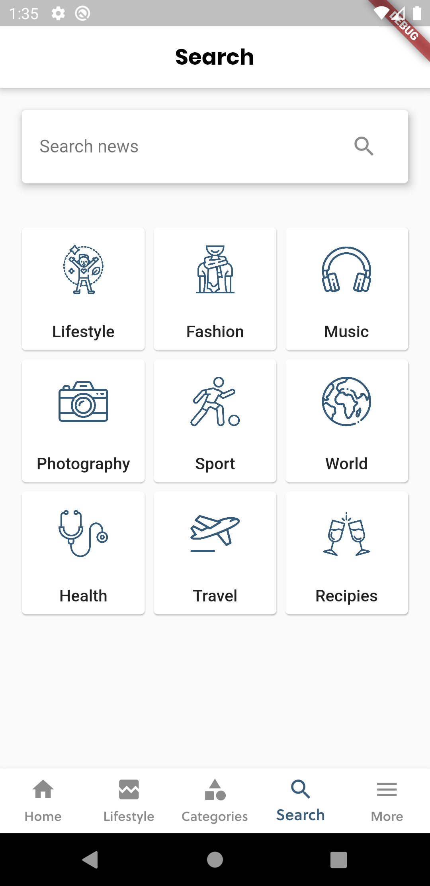|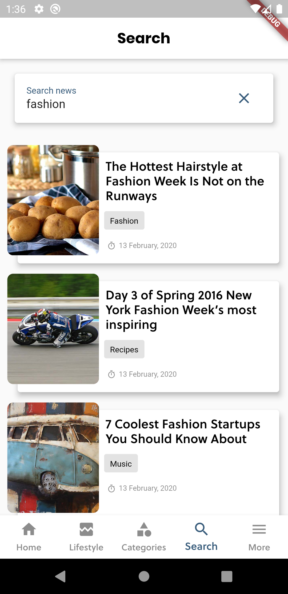|
|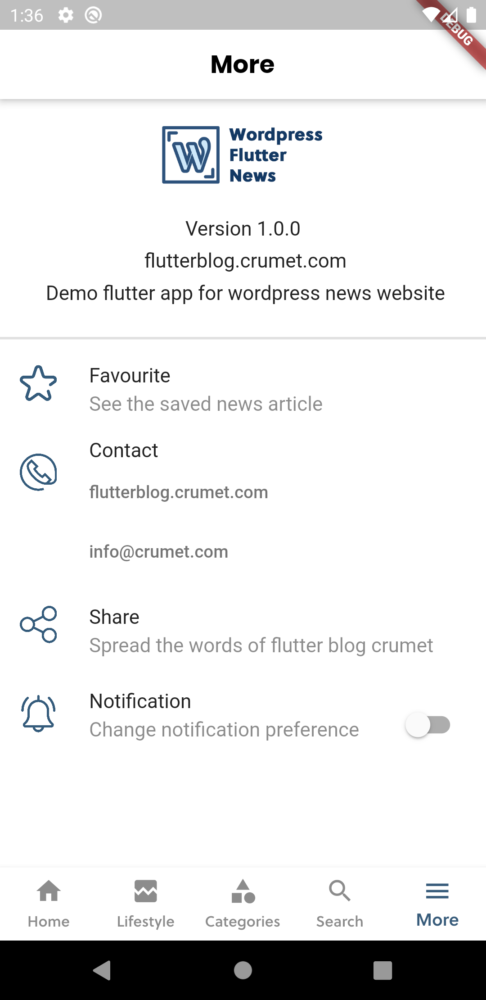|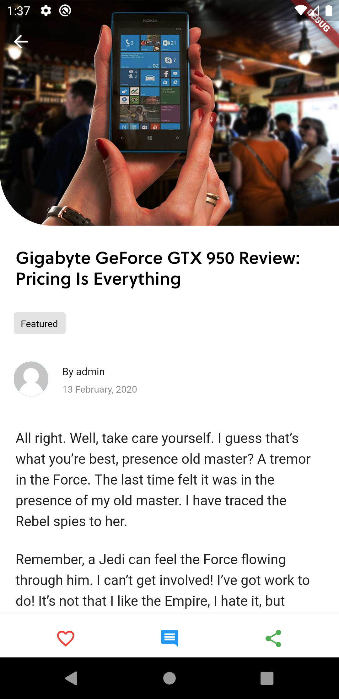||
|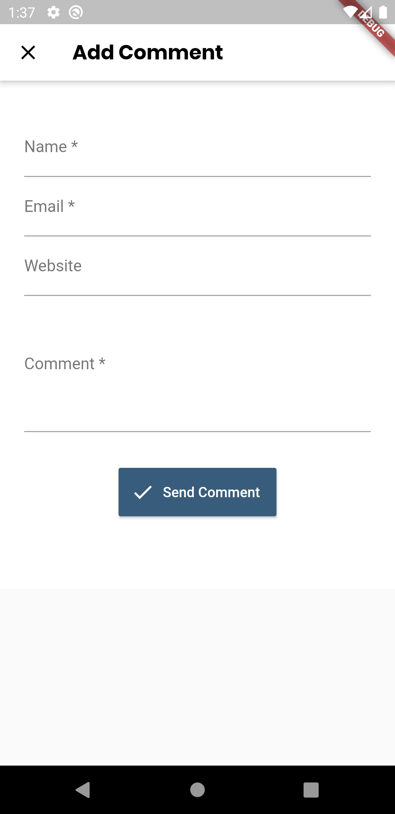|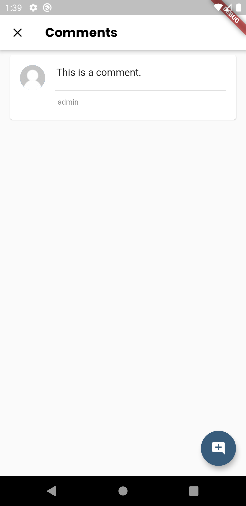|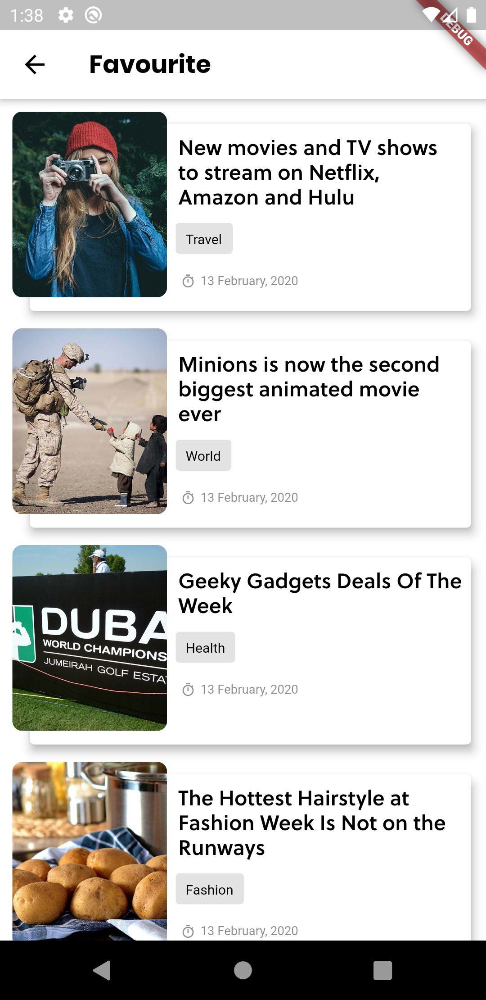|

## 🙌 Want to Contribute?

We are open to all kinds of contributions. If you want to:
* 🤔 Suggest a feature
* 🐛 Report an issue
* 👨‍💻 Contribute to the code


## 📑 LICENCE

Released under the [MIT](./LICENSE) License.<br>
